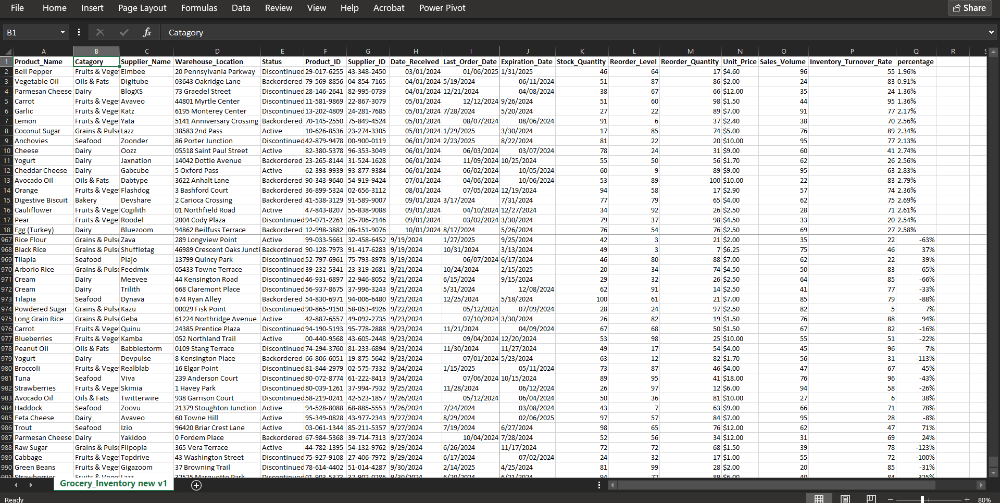

# 📦 Inventory & Warehouse Management Dashboard (Excel-Based)

📘 **Dataset Source:**  
Dataset of IT Job Vacancies and Requirements in the Asia-Pacific Region  
👉 [Kaggle - BMW Worldwide Sales Records (2010–2024)](https://www.kaggle.com/datasets/ahmadrazakashif/bmw-worldwide-sales-records-20102024/data)

## 🧭 Executive Summary
This project focuses on analyzing and visualizing **Inventory & Warehouse Management** data using **Microsoft Excel** as the primary tool.  
The dataset, sourced from **Kaggle (open source)**, contains detailed records of products, suppliers, warehouse locations, stock levels, pricing, and turnover rates.  

The main objective is to provide **clear and actionable insights** regarding inventory performance — such as identifying stock inefficiencies, turnover trends, and product status distribution — to support better operational decision-making and stock optimization.

Through the development of an **interactive Excel dashboard** (utilizing Pivot Tables and Power Pivot), the analysis delivers both **quantitative summaries** and **visual insights**, enabling stakeholders to quickly monitor inventory health, assess stock risks, and prioritize replenishment activities.

---

## 💼 Business Problem
Inventory management plays a vital role in ensuring a company’s supply chain runs smoothly and efficiently. Effective inventory management is crucial for maintaining operational efficiency, ensuring product availability, and minimizing holding costs. How many products have expired and what is their financial value?

---

## ⚙️ Methodology
All data processing, cleaning, transformation, and visualization were conducted entirely using **Microsoft Excel** (including Power Query, Pivot Table, and Power Pivot).  
The workflow includes the following key steps:

### 🧹 Data Cleaning & Transformation
- **Removed duplicates** based on `Product_ID` to ensure data integrity.  
- **Handled missing values**, where only one row contained null data, and addressed accordingly.  
- **Validated and corrected inconsistencies**, ensuring accuracy across numerical and categorical fields.  
- **Standardized data formats**, especially date columns, using **Power Query** for consistent time-based calculations.  
- **Created two new calculated fields:**
  - `expired_status` → derived from `Last_Order_Date` and `Expiration_Date`, indicating whether a product is expired or still active.  
  - `stock_value` → calculated product of `Stock_Quantity` and `unit_price`, representing the complete stock value.

---

## 🧠 Skills & Tools Utilized

### 🧩 Excel Analytical Skills
- **Data Aggregation** — summarizing large datasets efficiently using Pivot Tables and calculated measures.  
- **VLOOKUP & Lookup Functions** — for merging reference data and ensuring relational integrity.  
- **Pivot Table / Power Pivot Modeling** — building data models, defining relationships, and calculating KPIs dynamically.  
- **Power Query** — for data cleaning, transformation, and standardization of formats (especially dates).  
- **Dashboard Design** — developing interactive and insightful visualizations for operational reporting.

### 🛠️ Technical Environment
- Microsoft Excel (Power Query, Power Pivot, Pivot Chart)  
- Kaggle (as data source)  
- GitHub (for project documentation and versioning)

---

## 📊 Results and Business Recommendations

### 🧾 **Results**
The inventory dashboard highlights that the **Fruits & Vegetables** category contributes the most in terms of both stock quantity and stock value, with **18,558 units worth $90,625**.  
Overall, total stock reaches **55,053 units valued at $332,655**, with **18,621 units requiring restock**.  
This indicates that the category is the backbone of the inventory, thus requiring stricter management in storage, stock rotation, and restocking strategies.

From the **expired product** perspective, total expired items amount to **26,945 units worth $163,859**.  
The *Fruits & Vegetables* category alone accounts for **9,098 units (33.8%)** of the total expired stock, with a loss of **$39,885**.  

Interestingly, while *Beverages* (**2,195 units, 8.1%**) and *Seafood* (**2,904 units, 10.8%**) contribute relatively small expired quantities, their losses are quite significant at **$35,182** and **$32,425**, respectively — nearly matching *Fruits & Vegetables*.  
This indicates that even products with smaller quantities can cause substantial financial impact if their **unit value is high**, making it critical for management to monitor not only fresh goods but also **high-value categories** to minimize waste.

### 💡 **Business Recommendations**
1. **Prioritize management of the Fruits & Vegetables category**  
   Since this category holds the largest share of both stock and value, stricter storage practices, **stock rotation (FIFO/FEFO)**, and **restocking policies** are essential to minimize expiration risk.
2. **Implement an alert system for near-expiry products**  
   Automated alerts in the dashboard can help warehouse and management teams take timely action — e.g., **quick discounts, promotions, or early redistribution** — to reduce potential losses.
3. **Diversify sales strategies for critical categories**  
   For high-margin but perishable products (e.g., **Seafood**), consider **bundling promotions** or **partnerships with retailers/restaurants** to accelerate stock turnover and improve cash flow.

---

## 🚀 Next Steps

1. **Further Data Validation**  
   Ensure expired data truly reflects warehouse reality by cross-checking **system vs physical stock records** to improve data reliability and decision accuracy.
2. **Product-Level Analysis**  
   Break down which specific items within **Fruits & Vegetables, Beverages, and Seafood** contribute most to **expiration and financial loss**, enabling targeted corrective actions.
3. **Demand Pattern Identification**  
   Analyze **monthly and seasonal sales trends** to better predict restocking needs and optimize inventory planning.
4. **Financial Impact Simulation**  
   Estimate potential **financial losses** from expired products if no stock management improvements are implemented, to quantify the cost of inaction.
5. **Design Intervention Strategies**  
   Develop actionable solutions such as **quick discounts**, **bundle promotions**, or **partnerships with retailers/restaurants** to reduce near-expiry inventory and improve turnover.
6. **Enhance Dashboard with Alert System**  
   Add **automated notifications** for products with sharp stock declines or approaching expiry dates to enable proactive inventory management.

---

## 👤 Author
**[Faturahman]**  
Data Analyst | Excel Dashboard Specialist | Supply Chain Optimization  
📧 [233419245+faturahman03@users.noreply.github.com]  
🔗 [www.linkedin.com/in/faturahman183]
